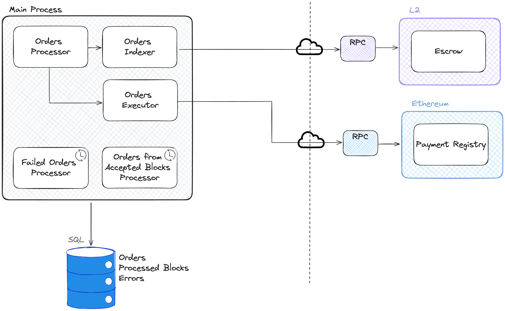
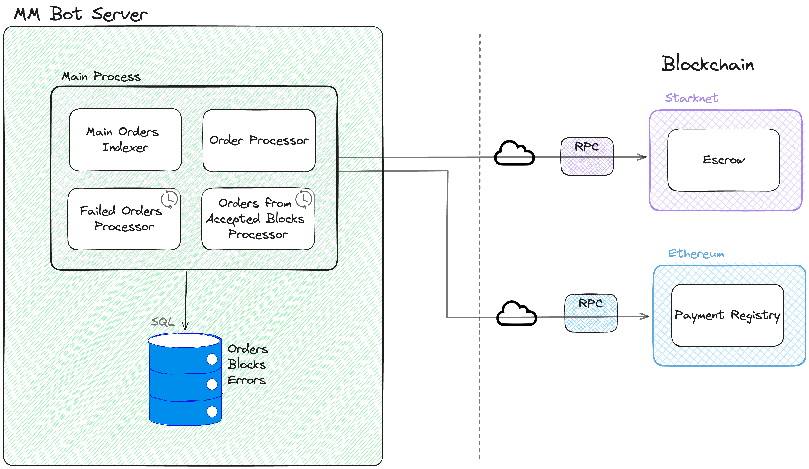

# MM Bot
MM Bot is a process designed to supply liquidity to YAB Escrow orders.

## Logical View
### Functional Requirements
- The bot must be able to read an order from the Escrow contract.
- The bot must be able to perform a transfer in Ethereum to the recipient address through the Payment
Registry contract.
- The bot must be able to perform a repay in Ethereum to recover the funds in the L2 through the
Payment Registry contract.
- The bot must be able to store the orders in a database and update their status.
- In case of an error, the bot must be able to store the error and retry the order.

### Simplified Class Diagram
The following diagram shows the mm classes and how they interact with each other.

> **_NOTE:_**  To make the diagram more readable, some relationships were omitted.

### Full Class Diagram
The following diagram is a detailed version of the previous diagram, 
showing the attributes and methods of each class.

> **_NOTE:_**  To make the diagram more readable, some relationships were omitted.

## Process View
### Non-Functional Requirements
- The bot must be able to handle multiple orders concurrently.
- The bot must be able to retrieve the status of the orders in case of interruption and complete them.
- The bot must be highly available.
- The bot must index the orders that belong to accepted blocks to ensure that orders are not lost.
- The bot must be able to retry failed orders.
- The bot must generate adequate logs for order tracking.

### Architecture
The bot architecture is as follows:

An `Orders Processor`  is needed to process the orders for each L2.
Each `Orders Processor` has an `Orders Indexer` and an `Order Executor`.

The `Orders Indexer` is responsible for indexing the orders from the L2 Escrow. It indexes orders by reading Escrow's events, 
and when it finds a new order, it stores it in the database. Then, `Orders Processor` is able to assign the new order 
to an `Order Executor`.

The `Order Executor` is responsible for processing an individual order. This means, it will transfer the funds to the 
recipient in L1 and claim the funds in L2.

To ensure that the orders are not lost, the bot has an `Accepted Blocks Processor` that indexes the orders that belong
to already accepted blocks, and stores them in the database. This way, if the `Orders Processor` loses an order, it will be
captured and processed by the `Accepted Blocks Processor`.

The bot has a `Failed Orders Processor` that is responsible for retrying the failed orders. When an order fails, the bot
stores the error, and marks the order as failed. This way, the `Failed Orders Processor` is able to retry the failed orders.

An important aspect of this bot is that it must be able to process multiple orders at the same time.
For that reason, the bot uses the library 'asyncio' to handle orders concurrently. This approach, 
preferred over using threads, is particularly suitable for the bot's I/O-bound nature and the potential 
high volume of orders it could potentially need to manage.

Another important requirement is that the bot must have a reliable network connection to communicate
with Ethereum's and the L2 networks' RPCs. Accordingly, the bot has two RPC providers for each network. If the 
primary provider fails, the bot will switch to the secondary provider.

## Physical View
A server is needed to run the MM Bot's Main Process.

Also, two servers are needed for the database, one for the main database and another one to act as its read replica.
This read replica is for external applications, like explorers, so that these don't affect the main database's performance and/or implicate any security concerns.

## Scenarios
### 1. Order Processing Flow
The following diagram shows the complete process of an order.

And each has the following states:

### 2. Failed Orders Reprocessing

### 3. Shutdown Recovery
When the bot starts, it retrieves incomplete orders from the database and continues their processing.

### 4. Accepted Blocks Indexation

