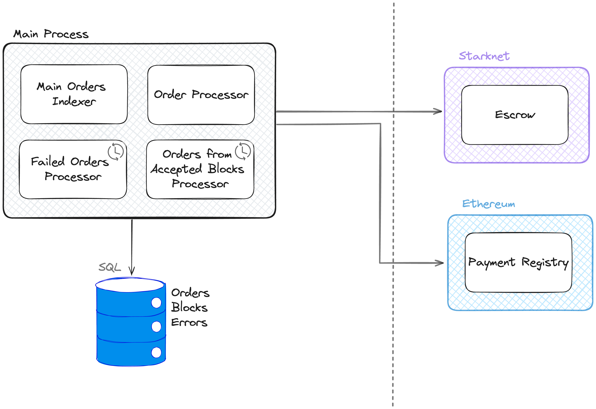
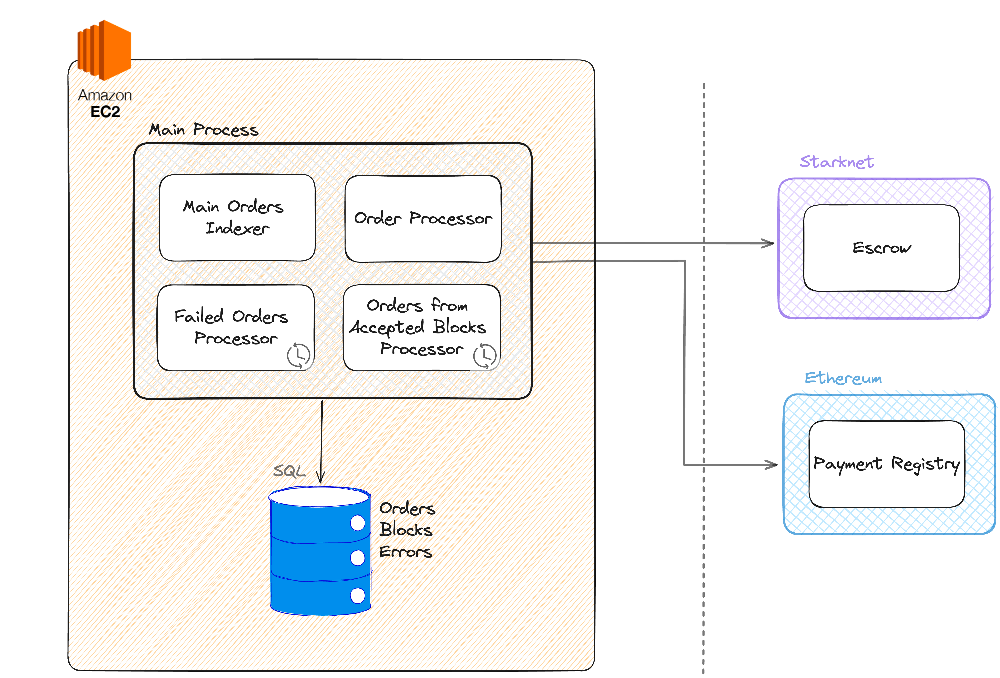

# MM Bot
MM Bot is a process designed to supply liquidity to YAB Escrow orders.

## Logical View
### Functional Requirements
- The bot must be able to read an order from the Escrow contract.
- The bot must be able to perform a transfer in Ethereum to the recipient address through the Payment
Registry contract.
- The bot must be able to perform a repay in Ethereum to recover the funds in the L2 through the
Payment Registry contract.
- The bot must be able to store the orders in a database and update their status.
- In case of an error, the bot must be able to store the error and retry the order.

### Simplified Class Diagram
The following diagram shows the mm classes and how they interact with each other.

### Full Class Diagram
The following diagram is a detailed version of the previous diagram, 
showing the attributes and methods of each class.

## Process View
### Non-Functional Requirements
- The bot must be able to handle multiple orders concurrently.
- The bot must be able to retrieve the status of the orders in case of interruption and complete them.
- The bot must be highly available.
- The bot must index the orders that belong to accepted blocks to ensure that orders are not lost.
- The bot must be able to retry failed orders.
- The bot must generate adequate logs for order tracking.

### Architecture
The bot architecture is as follows:

The bot is composed of the following components:
- **Main Process**: The main process of the bot. It has the following subcomponents:
    - `Main Order Indexer`: The `Main Order Indexer` is responsible for indexing the orders from 
    the pending blocks.
  - `Order Processor`: Responsible for processing the orders.
  - `Failed Orders Processor`: Responsible for retrying the failed orders.
  It runs every 5 minutes.
  - `Accepted Blocks Processor`: Responsible for indexing the orders that belong to accepted blocks. It runs every 5 minutes.
- **Database**: The database is used to store the following data:
  - Orders
  - Errors
  - Block numbers

An important aspect of the bot is that it must be able to handle multiple orders concurrently.
For that reason, the bot uses the library 'asyncio' to handle orders concurrently. This approach, 
preferred over using threads, is particularly suitable for the bot's I/O-bound nature and the potential 
high volume of orders it could potentially need to manage.

Another important requirement is that the bot must have a reliable network connection to communicate
with Ethereum's and L2 networks' RPCs.

## Physical View
The system is currently deployed in an EC2 virtual machine in AWS.
This EC2 runs the bot Main Process as well as its database. 

## Scenarios
### 1. Order Processing Flow
The following diagram shows the complete process of an order.

And each has the following states:

### 2. Failed Orders Reprocessing
When an order fails, the bot stores the error, and marks the order as failed. This way, the `Failed
Orders Processor` is able to retry the failed orders. The following diagram shows the flow of a 
failed order through the bot.

### 3. Shutdown Recovery
When the bot starts, it retrieves incomplete orders from the database and continues their processing.

### Accepted Blocks Indexation
The Main Order Indexer processes orders from pending blocks. The `Orders from
Accepted Blocks Processor` will index the orders that belong to accepted blocks. This way, if the `Main Order
Indexer` loses an order, it will be captured and processed by the `Orders from Accepted Blocks Processor`.

