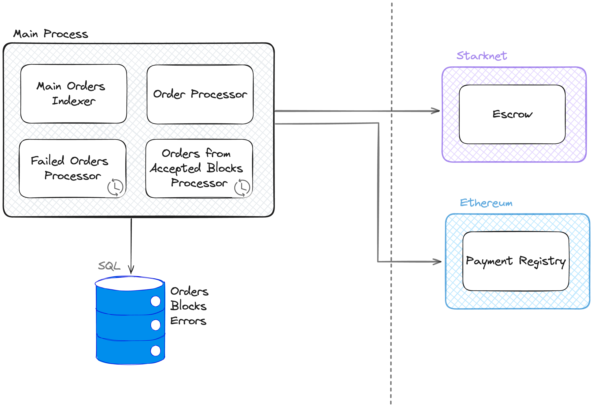
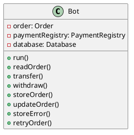

# MM Bot
MM Bot is a process designed to supply liquidity to YAB Escrow orders.

## Logical View
### Functional Requirements
- The bot must be able to read an order from the Escrow contract.
- The bot must be able to perform a transfer in Ethereum to the recipient address through the Payment
Registry contract.
- The bot must be able to perform a withdrawal in Ethereum to recover the funds in the L2 through the
Payment Registry contract.
- The bot must be able to store the orders in a database and update their status.
- In case of an error, the bot must be able to store the error and retry the order.

[Diagrama de clases]
## Process View
### Non-Functional Requirements
- The bot must be able to handle multiple orders simultaneously.
- The bot must be able to retrieve the status of the orders in case of interruption and complete it.
- The bot must be highly available.
- The bot must index the orders that belong to accepted blocks to ensure that orders are not lost.
- The bot must be able to retry failed orders.
- The bot must be able to perform adequate logs for the orders tracking.

### Simplified Class Diagram

## Development View (TODO)

## Physical View
[Version completa de la arquitectura]

## Scenarios
1 Flujo de una orden
[Estado de una orden]

2 Orden fallida

3 Recuperacion de estado

4 Indexacion bloques aceptados
